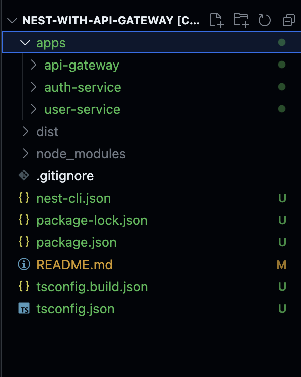
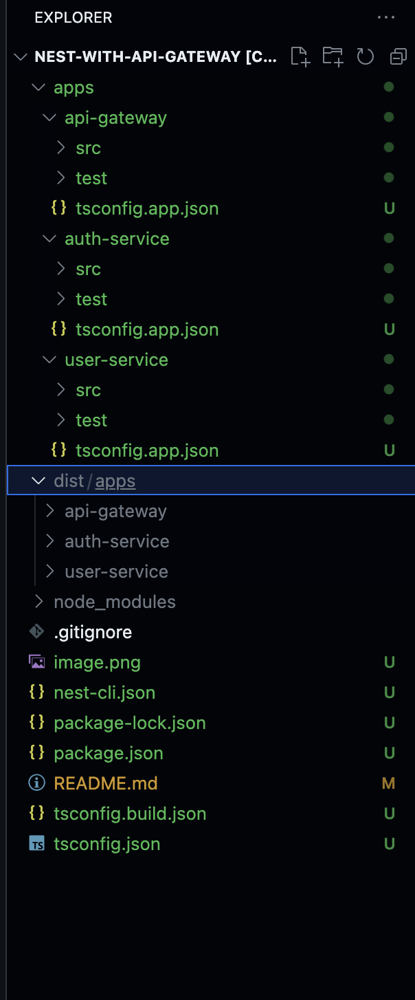

# nest-with-api-gateway
I have followed nest best practice to generate mono-repo structure with nest. Here is the project structure. 

All project dependencies will be manages at root level. No need to install separate dependencies in each microservice module. 

# Detailed structure: 

# Install dependencies 
npm install 

# run api gateway module
npm start --project api-gateway

# run users module
npm start --project user-service

# run auth module
npm start --project auth-service

# Access users and auth api with these endpoints
http://localhost:3000/users (will be served from user-service)
http://localhost:3000/auth  (will be server from auth-service)